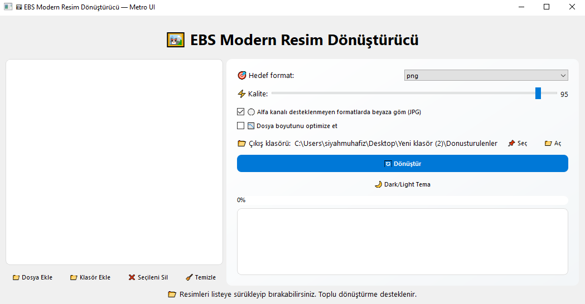

🖼️ Modern Resim Dönüştürücü

PyQt5 ile geliştirilmiş, modern arayüze sahip ve çoklu resim dönüştürme işlemleri için optimize edilmiş bir masaüstü uygulaması.
---
Ekran Görüntüsü

---

Özellikler

- 📂 Sürükle & Bırak Desteği: Resimleri doğrudan uygulamaya sürükleyip bırakabilirsiniz.
- 🔄 Toplu Dönüştürme: Birden fazla resmi aynı anda dönüştürebilirsiniz.
- 🎯 Hedef Format Seçimi: PNG, JPG, WEBP, BMP, TIFF, GIF gibi popüler formatlara dönüştürme.
- ⚡ Kalite Ayarı: Dönüştürülen resimlerin kalitesini ayarlayabilirsiniz.
- ⚪ Alfa Kanalı Desteği: Alfa kanalı içeren resimleri destekler ve gerektiğinde beyaza gömme işlemi yapar (JPG formatında).
- 📉 Dosya Boyutu Optimizasyonu: Dönüştürülen resimlerin boyutlarını optimize edebilirsiniz.
- 🌙 Karanlık/Aydınlık Tema: Uygulamanın temasını karanlık ve aydınlık arasında değiştirebilirsiniz.
- 🖌️ Metro UI Tasarımı: Modern ve kullanıcı dostu bir arayüz.
- 📊 İlerleme Çubuğu ve Sonuç Kutusu: Dönüştürme sırasında ilerlemeyi görebilir ve tamamlanan dosyaların durumunu inceleyebilirsiniz.

---

Desteklenen Dosya Türleri

Bu uygulama aşağıdaki resim dosyalarını dönüştürebilir:

- PNG (.png)
- JPEG / JPG (.jpg, .jpeg)
- BMP (.bmp)
- GIF (.gif)
- TIFF (.tiff)
- WEBP (.webp)

Not: Eğer desteklenmeyen bir dosya eklenirse, uygulama bunu sonuç kutusunda belirtecektir.

---

Kurulum

1. Gereksinimler:

   - Python 3.8 veya üstü
   - PyQt5
   - Pillow

2. Kütüphaneleri yüklemek için:

pip install PyQt5 Pillow

3. Uygulamayı çalıştırmak için:

python image_converter.py

---

Kullanım

1. Uygulamayı başlatın.
2. Resimleri sürükleyip bırakın veya "Dosya Ekle" / "Klasör Ekle" butonlarını kullanın.
3. Hedef formatı seçin (PNG, JPG, WEBP vb.).
4. Kalite değerini ayarlayın ve alfa kanalı gömme / optimize et seçeneklerini belirleyin.
5. "Dönüştür" butonuna tıklayın.
6. İşlem tamamlandığında sonuç kutusunda başarılı ve başarısız dosyalar listelenecektir.
7. Çıkış klasörünü "Aç" butonuyla görüntüleyebilirsiniz.
8. Tema değiştirmek için "Dark/Light Tema" butonuna tıklayın.

---
Lisans

Bu proje MIT Lisansı ile lisanslanmıştır. Her türlü kullanım ve dağıtım serbesttir, değişiklik yapabilirsiniz.

---

İletişim

Sorularınız veya katkılarınız için [ebubekirbastama](https://www.linkedin.com/in/ebubekirbastama/) ile iletişime geçebilirsiniz.
